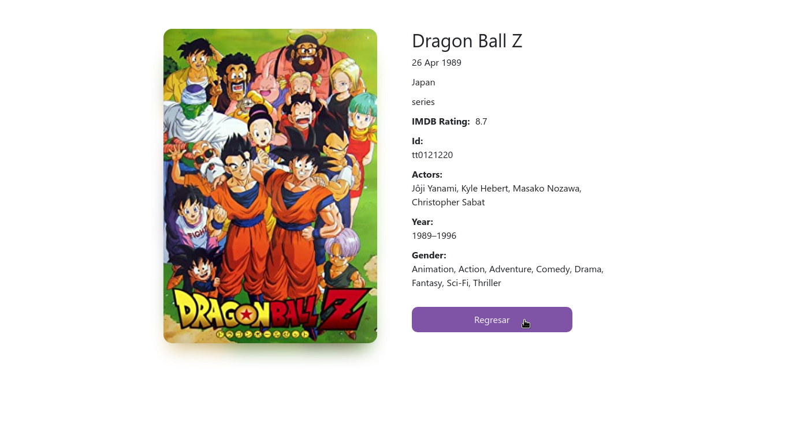

## Buscador de peliculas en React JS

Encuentra tu **pelicula favorita**, y descubre mas informacion acerca de ella 

Tecnologias Usadas:

* React JS
* CSS3 
* HTML 5
* Omdb API

¿Quieres probarla?

```
git clone https://github.com/dennismartel/BuscadorPeliculasReact

cd BuscadorPeliculasReact/

npm i && npm start
```

## Capturas de pantalla del proyecto ##



## El proyecto esta creado con ##
create-react-app
