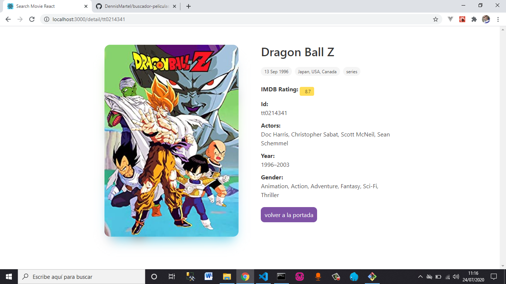
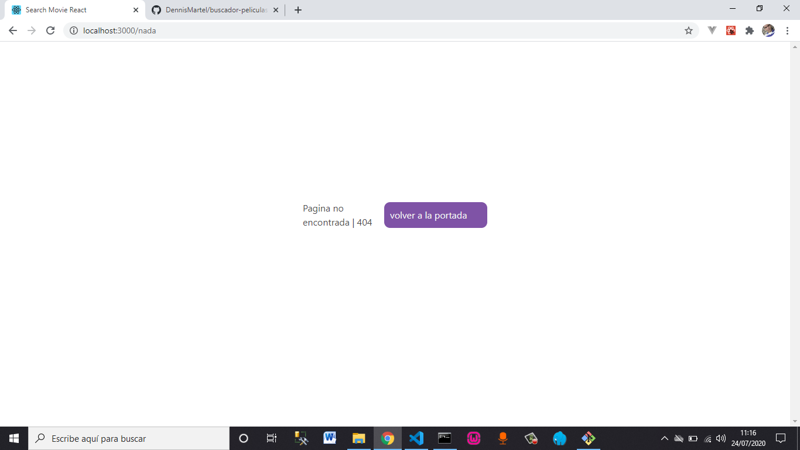

## Buscador de peliculas en React JS

Encuentra tu **pelicula favorita**, y descubre mas informacion acerca de ella 

Tecnologias Usadas:

* React JS
* CSS3 
* HTML 5
* Omdb API

¿Quieres probarla?

```
git clone https://github.com/dennismartel/BuscadorPeliculasReact

cd BuscadorPeliculasReact/

npm i && npm start
```

## Capturas de pantalla del proyecto ##





## El proyecto esta creado con ##
<a href='https://github.com/facebook/create-react-app' target='__blank'>Create-React-App</a>
